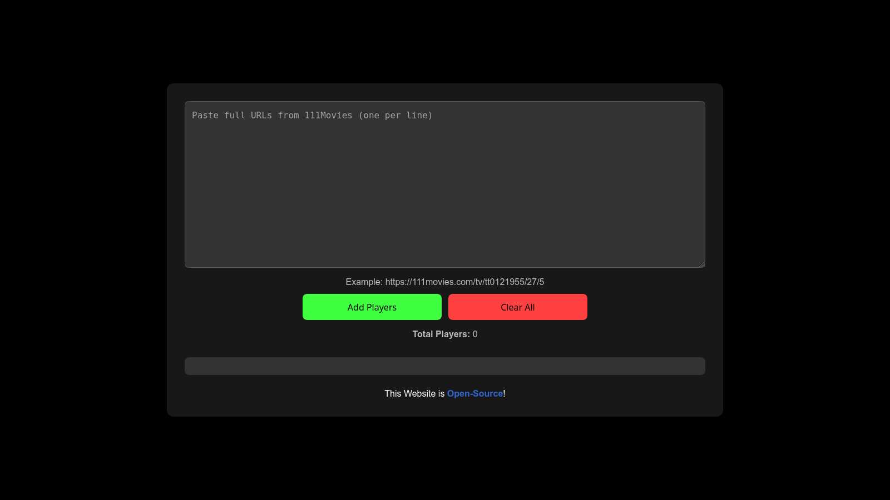

# Bulk Video Player

A simple web app that allows you to bulk add video players by pasting URLs from the 111Movies website. The app dynamically embeds the video players in an easy-to-use interface. You can then use [Video DownloadHelper](https://www.downloadhelper.net/) to download all embedded content at once.

**Note:** This project is made for desktop. Mobile usage is untested.  



## Features

- Paste full URLs from 111Movies (one URL per line).
- Add multiple video players at once.
- Clear all video players with a single click.
- Displays the total number of players added.
- Download all the added content using Video DownloadHelper.

## How to Use

### Step 0: Install Prerequisites
Before using the app, make sure you have:

1. [Firefox](https://www.firefox.com/en-US/thanks/) installed.  
2. [Video DownloadHelper](https://www.downloadhelper.net/) extension installed in Firefox.  

> This web app is built around the extension, which only works in Firefox.

### Step 1: Run the App

You have two options:

**Option A: Use GitHub Pages (no installation needed)**

- Open the [GitHub Pages Website](https://nikoboinftb.github.io/Bulk-Video-Player/) in Firefox.

**Option B: Run Locally**

1. **Clone or Download the Repository**:  
   - Clone using Git:  
     ```bash
     git clone https://github.com/NikoboiNFTB/Bulk-Video-Player
     ```
   - Or [Download ZIP](https://github.com/NikoboiNFTB/Bulk-Video-Player/archive/refs/heads/main.zip) and extract it.

2. **Open `index.html`** in Firefox.

### Step 2: Add Players

1. Paste **one or more URLs** from 111Movies into the input box (one per line).  
2. Click **"Add players"** to embed the videos.

> Tip: It’s better to download a few players at a time rather than dozens or hundreds at once.

### Step 3: Download Videos

- Use the **Video DownloadHelper** extension in Firefox to download the embedded videos.

### Step 4: Clear Players

- Click **"Clear all"** to remove all players from the page.  
- Add more players if needed and repeat steps 2–4.

## License

This project is licensed under the [GPLv3 License](https://www.gnu.org/licenses/gpl-3.0.en.html).
